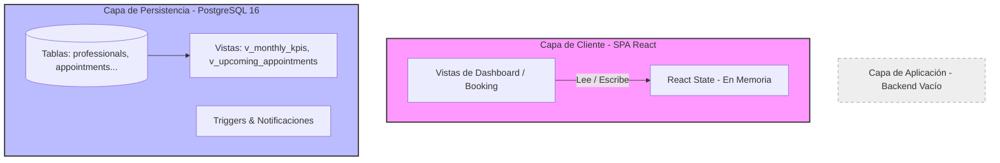

# Análisis Técnico del Proyecto: AgendaFácil (MVP)

Este documento presenta un análisis estructurado y detallado del estado actual del proyecto **AgendaFácil**, diseñado para servir como base para la redacción de un informe técnico formal.

---

## 1. Ficha Técnica y Stack Tecnológico

El proyecto está estructurado como una aplicación moderna de dos componentes principales (Frontend y Base de Datos), con la carpeta de Backend preparada para albergar la lógica del servidor en fases posteriores.

### Capa de Frontend
* **Lenguaje:** TypeScript + JavaScript (ES Modules).
* **Framework Principal:** **React (v18.3.1)** configurado mediante **Vite (v6.3.5)**.
* **Enrutamiento (Routing):** **React Router (v7.13.0)** para el control de rutas e historial del lado del cliente.
* **Estilos y Diseño:** **Tailwind CSS (v4.1.12)** acoplado mediante la integración nativa `@tailwindcss/vite`, complementado con librerías de interactividad y accesibilidad:
  * **Radix UI Primitives:** (`@radix-ui/react-*`) para componentes interactivos limpios y accesibles (acordeones, diálogos, menús desplegables, barras de progreso, etc.).
  * **Lucide React:** Para el set de íconos vectoriales del dashboard.
  * **Motion (Framer Motion):** Para las transiciones y micro-animaciones en el dashboard y vistas de usuario.
* **Visualización de Datos:** **Recharts (v2.15.2)** configurado en dependencias (aunque las analíticas actuales se simulan a través de estructuras CSS animadas para optimizar el rendimiento y el diseño visual del MVP).
* **Gestión de Fechas:** **date-fns (v3.6.0)** y **react-day-picker (v8.10.1)** para la lógica de calendarios.

### Capa de Base de Datos
* **Motor:** **PostgreSQL 16** (diseñado con especificaciones para alojamiento en la plataforma Railway).
* **Control de Esquemas:** Archivo `database/schema.sql` que inicializa el modelo relacional reliazando el tipado fuerte mediante ENUMs y triggers de automatización.

---

## 2. Análisis Arquitectónico y Modelo de Diseño

El usuario pregunta si la estructura del proyecto corresponde a un modelo **BFF (Backend for Frontend)** u otro tipo de modelo.

### ¿Es un modelo BFF?
**No, en su estado actual el proyecto no implementa un patrón BFF.**
Un *Backend For Frontend* es un patrón de diseño en el cual se construye un servidor intermedio (Gateway) específico para un cliente determinado (por ejemplo, un BFF para la App Móvil y otro BFF para la Web App) con el fin de filtrar, formatear y agregar datos de microservicios para reducir la carga del cliente.

### Modelo Actual: Arquitectura Cliente-Servidor Desacoplada (Decoupled Two-Tier / Client-Server Blueprint)
Actualmente, el proyecto se encuentra en una fase de **MVP Estático / Frontend-Driven**. La arquitectura real implementada se define como:

1. **Frontend Autónomo (SPA con Datos Simulados):** La aplicación React funciona como una *Single Page Application* (SPA). Toda la lógica de negocio (agendar una cita, crear clientes, ver analíticas) utiliza un **estado en memoria local (`useState`)** y datos en duro (mocks). No existe comunicación HTTP (fetch/axios) con un servidor.
2. **Capa de Datos Pasiva (Plano de Base de Datos):** La base de datos relacional está completamente definida a nivel de esquema SQL en PostgreSQL, pero no está conectada al frontend. Es un "plano" listo para producción.
3. **Capa de Backend en Espera:** La carpeta `backend` está vacía, lo que confirma que el MVP actual carece de un controlador de backend en ejecución.

---

## 3. Funcionamiento Interno del MVP

El flujo del frontend está diseñado para demostrar la experiencia de usuario final en dos flujos clave:

### A. Portal Público de Reservas (`Booking.tsx`)
Este portal es el que ven los pacientes finales al acceder a la URL `/book/:username`.
* **Flujo del proceso:** 
  1. **Servicios (`Step 0`):** El cliente selecciona el servicio deseado (Consulta General, Terapia de Pareja, Evaluación Inicial).
  2. **Fecha (`Step 1`):** Se selecciona el día mediante el componente interactivo `DayPicker` adaptado con la localización en español.
  3. **Hora (`Step 2`):** Se muestran las horas disponibles basadas en un arreglo estático en el frontend.
  4. **Datos (`Step 3`):** Se captura el formulario con el nombre, correo y teléfono del cliente.
  5. **Confirmación:** Al enviar el formulario, el sistema simula un flujo de guardado y redirige a la vista de éxito (`BookingSuccess.tsx`).

### B. Dashboard del Profesional (`Dashboard.tsx`, `ClientsView.tsx`, `AnalyticsView.tsx`)
Este es el portal privado donde el profesional (terapeuta/psicólogo) gestiona su agenda.
* **Calendario Principal (`Dashboard.tsx`):** Muestra una grilla semanal u diaria de horas de atención. Permite registrar citas haciendo clic en bloques de hora vacíos para abrir un modal de creación (`CreateAppointmentModal.tsx`) que inserta el evento temporalmente en el estado de React.
* **Gestión de Clientes (`ClientsView.tsx`):** Muestra el listado de pacientes registrados, permitiendo filtrar búsquedas por nombre, visualizar el historial clínico (Notas Clínicas con Markdown y opción para resumir historial mediante la API de Gemini) y adjuntos.
* **Analíticas (`AnalyticsView.tsx`):** Simula la carga de datos del servidor con un retardo (`setTimeout` de 1.2s) para emular latencia de red real. Muestra KPIs como Ingresos del mes, Tasa de Asistencia y gráficos descriptivos sobre citas y servicios populares.

---

## 4. Estructura de Datos (Esquema PostgreSQL)

A diferencia del Frontend que usa mocks, el archivo `database/schema.sql` describe un sistema transaccional robusto y listo para producción, con 10 tablas principales estructuradas para soportar multi-tenant (donde múltiples profesionales operan aislados en la misma BD):

| Tabla | Propósito | Características Clave |
| :--- | :--- | :--- |
| `professionals` | Datos del profesional que usa el sistema. | UUID como PK, slugs para URLs públicas de reserva, cifrado de tokens externos (Google, Stripe) e indicator de onboarding. |
| `schedules` | Horarios de atención fijos por día de la semana. | Restricción única por día y profesional. Validación de consistencia temporal (`end_time > start_time`). |
| `schedule_exceptions` | Excepciones horarias (vacaciones, feriados). | Bloquea días completos o modifica franjas horarias específicas. |
| `services` | Portafolio de servicios ofrecidos. | Configura duración, precio, moneda (CLP por defecto), modalidad (Virtual/Presencial) y colores para el calendario. |
| `clients` | Registro de pacientes por profesional. | Búsqueda optimizada con índice GIN sobre nombre completo y contacto de emergencia. |
| `appointments` | Citas agendadas (Eje central del negocio). | Almacena estados de cita y pago. Guarda scores de probabilidad de inasistencia (No-Show Score) calculado por Inteligencia Artificial. |
| `clinical_notes` | Registro clínico del paciente. | Diseñado como **Append-Only** (inmutable). No se edita la nota existente; se crea una nueva versión enlazada a su padre para mantener auditoría médica. |
| `attachments` | Archivos clínicos adjuntos. | Almacena metadatos y llaves únicas de almacenamiento en la BD. Los archivos reales se guardan en Object Storage (Amazon S3 / Cloudflare R2). |
| `notifications` | Sistema de alertas internas del dashboard. | Notifica automáticamente cuando hay cambios en el estado de las citas. |
| `ai_interactions` | Logs de conversaciones e intenciones de Gemini. | Guarda auditoría de acciones ejecutadas por la IA en favor del profesional (ej. reagendar una cita). |

### Automatizaciones a Nivel de Base de Datos
* **Triggers de Auditoría:** Modifican automáticamente la columna `updated_at` a la hora del servidor cada vez que un registro se actualiza.
* **Triggers de Negocio:**
  * Al actualizar una cita a estado `CONFIRMED`, se inserta automáticamente una alerta en la tabla `notifications` para el profesional.
  * Al cancelar una cita, se genera una notificación del tipo `CANCELLATION`.
* **Vistas de Alto Rendimiento:**
  * `v_upcoming_appointments`: Retorna las citas vigentes del día resolviendo los nombres del cliente y servicio.
  * `v_monthly_kpis`: Realiza el cálculo mensual de ingresos pagados, citas agendadas, inasistencias y porcentaje de asistencia.
  * `v_latest_clinical_note`: Retorna solo la versión más reciente de la ficha clínica de cada paciente usando `DISTINCT ON (client_id)`.

---

## 5. Recomendaciones para Conectar la Aplicación

Para pasar de un MVP estático a un producto de producción integrado con la base de datos definida, existen dos caminos viables:

### Opción A: Construcción de una API intermedia en Node.js (Express o NestJS) en `backend/`
Esta opción es la más tradicional y segura.
* **Cómo funciona:**
  1. El frontend React hace solicitudes HTTP (`fetch` / `axios`) a un servidor Node.js/Express.
  2. El servidor Node.js valida la sesión del usuario (JWT), implementa la lógica de negocio compleja (validar solapamiento de horarios, cifrado de contraseñas, comunicación con APIs externas como Stripe o Google Calendar) y ejecuta consultas SQL en PostgreSQL usando un ORM como **Prisma** o **Drizzle**.
* **Ventajas:** Control total de la seguridad, facilidad para integrar lógica de IA (Gemini) en el servidor sin exponer llaves privadas en el frontend.

### Opción B: Uso de Supabase (PostgREST / Backend-as-a-Service)
Dado que el frontend ya está construido en React y la base de datos es PostgreSQL, Supabase encaja perfectamente.
* **Cómo funciona:**
  1. Se monta el esquema `schema.sql` en Supabase.
  2. Se instala el cliente `@supabase/supabase-js` en el frontend.
  3. El frontend consulta y escribe directamente en la base de datos a través de llamadas de librería segura, controladas por **Políticas de Seguridad a Nivel de Fila (RLS)** de PostgreSQL.
* **Ventajas:** No requiere codificar un servidor backend completo desde cero; el desarrollo es sumamente rápido y nativo para este tipo de stack.

---

*Este análisis técnico provee los pilares teóricos y descriptivos necesarios para armar el informe de arquitectura y MVP del proyecto AgendaFácil.*
